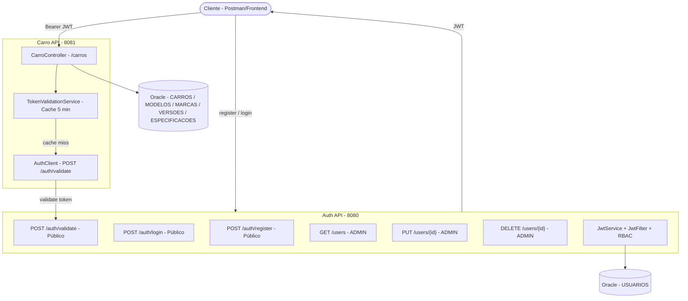

# Auth API — Autenticação e Gerenciamento de Usuários

> **Stack:** Java 21 · Spring Boot 4.0.6 · Spring Security · JWT (JJWT 0.11.5) · BCrypt · Spring Data JPA / Hibernate · Oracle DB · Bucket4j · Springdoc OpenAPI 3.0.2  
> **Porta:** `8080` | **Framework de testes:** JUnit 5 · MockMvc · Mockito

A Auth API é responsável por **autenticação, emissão/validação de JWT, cadastro e gerenciamento administrativo de usuários** dentro da solução orientada a serviços do Challenge da Ford.

---

## 1. Objetivo na Solução

```
Cliente
   ↓
Auth API  →  emissão e validação JWT
   ↓            gerenciamento de usuários
Carro API        RBAC (USER / ADMIN)
   ↓
Oracle
```

Responsabilidades da Auth API:
- `POST /auth/register` — cadastro público de usuários (sempre com role `USER`)
- `POST /auth/login` — autenticação e emissão de JWT
- `POST /auth/validate` — validação de JWT para serviços externos (ex.: CarroAPI)
- `GET /users` — listagem administrativa de usuários (ADMIN)
- `PUT /users/{id}` — atualização administrativa (ADMIN)
- `DELETE /users/{id}` — exclusão administrativa (ADMIN)

---

## 2. Tecnologias

| Tecnologia | Versão | Uso |
|------------|--------|-----|
| Java | 21 | Linguagem |
| Spring Boot | 4.0.6 | Framework base |
| Spring Security | via Boot | Filtros, `@PreAuthorize`, autenticação |
| JJWT | 0.11.5 | Geração/validação JWT (HS256) |
| BCrypt | via Boot | Hash de senhas |
| Spring Data JPA / Hibernate | via Boot | Persistência |
| Oracle | 19c+ | Banco relacional |
| Bucket4j | 8.10.1 | Rate limiting |
| Springdoc OpenAPI | 3.0.2 | Swagger UI |
| JUnit 5 / MockMvc / Mockito | via Boot | Testes automatizados |
| Lombok | via Boot | Redução de boilerplate |

---

## 3. Arquitetura

```
src/main/java/com/challenge/AuthApi/
├── AuthApiApplication.java
├── config/
│   ├── SecurityConfig.java    # stateless, CSRF off, filters, RBAC
│   └── SwaggerConfig.java     # OpenAPI + bearerAuth + info
├── controller/
│   ├── AuthController.java    # /auth/**
│   └── UserController.java    # /users/**
├── dto/
│   ├── RegisterRequest.java
│   ├── LoginRequest.java
│   ├── ValidateTokenRequest.java
│   ├── AuthResponse.java
│   ├── UserResponse.java
│   └── ValidateTokenResponse.java
├── entity/
│   └── User.java              # tabela USUARIOS
├── repository/
│   └── UserRepository.java
├── security/
│   ├── JwtService.java
│   ├── JwtFilter.java
│   └── RateLimitFilter.java
├── service/
│   └── UserService.java
└── exception/
    ├── GlobalExceptionHandler.java
    ├── UserAlreadyExistsException.java
    └── UserNotFoundException.java
```

Fluxo de autenticação:

```
POST /auth/register  → Bean Validation → verifica e-mail → BCrypt → role=USER → persiste
POST /auth/login     → findByEmail → matches BCrypt → JwtService.generateToken(email, role) → AuthResponse(token, email, role)
POST /auth/validate  → JwtService.isValid → extractEmail → findByEmail → {valid,email,role} ou 401
```

---

## 4. Autenticação e JWT

**JWT (HS256, HMAC-SHA256):**
- Header: `{ "alg": "HS256", "typ": "JWT" }`
- Claims: `sub` (email), `role` (USER/ADMIN), `iat`, `exp` (iat + 3600000 ms = 1h)
- Secret: `jwt.secret` em `application.properties`
- Expiração: `jwt.expiration=3600000` (1 hora)

```java
Jwts.builder()
    .setSubject(email)
    .claim("role", role)
    .setIssuedAt(new Date())
    .setExpiration(new Date(System.currentTimeMillis() + expiration))
    .signWith(getKey(), SignatureAlgorithm.HS256)
    .compact();
```

`JwtFilter` valida o `Authorization: Bearer <token>`, extrai `email`/`role` e popula `SecurityContextHolder` com `ROLE_<role>`.

---

## 5. Cadastro

### `RegisterRequest` — contrato atual

```java
public record RegisterRequest(
        @NotBlank @Size(min = 3, max = 100) String nome,
        @Email @NotBlank                    String email,
        @NotBlank @Size(min = 6)            String senha
) {}
```

> `role` **não faz parte do request**. Todo cadastro público recebe `role = USER` automaticamente no `UserService.createUser()`.

**Payload válido:**
```json
{
  "nome": "Maria Silva",
  "email": "maria@email.com",
  "senha": "senha123"
}
```

**Resposta — 201 Created:**
```json
{
  "id": 1,
  "nome": "Maria Silva",
  "email": "maria@email.com"
}
```

---

## 6. Roles e RBAC

| Role | Obtida via |
|------|------------|
| `USER` | cadastro público (`POST /auth/register`) |
| `ADMIN` | inserção direta no banco (SQL) ou atualização administrativa |

RBAC habilitado por `@EnableMethodSecurity` e `@PreAuthorize`:

| Endpoint | USER | ADMIN |
|----------|------|-------|
| `GET /users` | ❌ 403 | ✅ 200 |
| `PUT /users/{id}` | ❌ 403 | ✅ 200 |
| `DELETE /users/{id}` | ❌ 403 | ✅ 204 |

Endpoints públicos: `/auth/**`, `/swagger-ui/**`, `/v3/api-docs/**`.

---

## 7. Endpoints

| Método | Endpoint | Acesso | Descrição | Sucesso |
|--------|----------|--------|-----------|---------|
| POST | `/auth/register` | Público | Criar usuário (sempre USER) | 201 |
| POST | `/auth/login` | Público | Autenticar e emitir JWT | 200 |
| POST | `/auth/validate` | Público | Validar JWT (usado pela CarroAPI) | 200 / 401 |
| GET | `/users` | ADMIN | Listar usuários | 200 |
| PUT | `/users/{id}` | ADMIN | Atualizar usuário | 200 |
| DELETE | `/users/{id}` | ADMIN | Deletar usuário | 204 |

---

## 8. Contratos Relevantes

### `POST /auth/login` — Request
```json
{
  "email": "maria@email.com",
  "senha": "senha123"
}
```

### `POST /auth/login` — Response (AuthResponse)
```json
{
  "token": "eyJhbGciOiJIUzI1NiJ9...",
  "email": "maria@email.com",
  "role": "USER"
}
```

### `GET /users` — Response (UserResponse — sem senha/role)
```json
[
  {
    "id": 1,
    "nome": "Maria Silva",
    "email": "maria@email.com"
  }
]
```

> As respostas HTTP nunca expõem `senha`, `password`, `senhaHash` ou `role` nas listas/atualizações de usuários. O retorno utiliza `UserResponse(id, nome, email)` via conversão no `UserController`.

---

## 9. Tratamento de Erros

O `GlobalExceptionHandler` centraliza as respostas:

| Status | Quando | Exemplo |
|--------|--------|---------|
| 400 | Bean Validation falha | `{ "email": "deve ser um email válido" }` |
| 401 | Credenciais inválidas / token inválido / não autenticado | `"Credenciais inválidas"` |
| 403 | RBAC negado | `AccessDeniedException` (Spring Security) |
| 404 | Recurso não encontrado | `"User not found"` |
| 409 | E-mail duplicado | `"User already exists with this email"` |
| 500 | Erro inesperado | `"Ocorreu um erro interno no servidor."` (sem stack trace) |

---

## 10. Swagger / OpenAPI

| Recurso | URL |
|---------|-----|
| Swagger UI | `http://localhost:8080/swagger-ui/index.html` |
| OpenAPI JSON | `http://localhost:8080/v3/api-docs` |

- SecurityScheme: `bearerAuth` (HTTP Bearer JWT)
- Tags: `Authentication`, `Users`
- Operações, summaries e responses documentadas com `@Operation` e `@ApiResponses`

---

## 11. Testes Automatizados

```bash
mvn test
```

**45 testes passando**

| Grupo | Cenários |
|-------|----------|
| JWT | geração, validação, token alterado/expirado, extração de claims |
| UserService | cadastro (inclui role=USER automática), senha BCrypt, e-mail duplicado, autenticação válida/inválida, validação de token |
| AuthController | register (201/400/409, ignora role do cliente), login (200 com token/email/role, 401), validate (200/401) |
| UserController | GET/PUT/DELETE sem auth (401), USER→403, ADMIN→200/204, 404 para inexistente |

Cobertura funcional: cadastro, login, JWT, RBAC/404 e autorização.

---

## 12. Como Executar a Aplicação

### Pré-requisitos

| Item | Versão |
|------|--------|
| Java | 21 |
| Maven | 3.9+ |
| Oracle | 19c+ |

### Configuração do Banco

`src/main/resources/application.properties`:

```properties
spring.datasource.url=jdbc:oracle:thin:@oracle.fiap.com.br:1521:orcl
spring.datasource.username=RM557538
spring.datasource.password=150705
spring.datasource.driver-class-name=oracle.jdbc.OracleDriver
spring.jpa.hibernate.ddl-auto=update
jwt.secret=MinhaChaveSuperSecretaComMaisDe32CaracteresSeguros123!
jwt.expiration=3600000
server.port=8080
```

### Inicialização

```bash
# Executar
./mvnw spring-boot:run
# Windows
mvnw.cmd spring-boot:run
# Ou
mvn clean package -DskipTests
java -jar target/AuthApi-0.0.1-SNAPSHOT.jar
```

---

## 13. Diagrama da Solução



Fluxo remoto:

```
Cliente → CarroAPI (Bearer JWT)
CarroAPI → TokenValidationService (cache 5min)
         → AuthClient → POST http://localhost:8080/auth/validate
AuthAPI  → valida assinatura, exp e usuário no banco → {valid, email, role}
```
