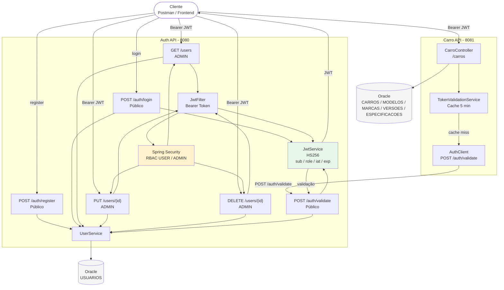

# Auth API — Autenticação e Gerenciamento de Usuários

> **Stack:** Java 21 · Spring Boot 4.0.6 · Spring Security · JWT (JJWT 0.11.5) · BCrypt · Spring Data JPA / Hibernate · Oracle DB · Bucket4j · Springdoc OpenAPI 3.0.2  
> **Porta:** `8080` · **Testes:** JUnit 5 · MockMvc · Mockito

A **Auth API** é responsável pela autenticação, emissão e validação de JWT, cadastro de usuários e gerenciamento administrativo de usuários dentro da solução orientada a serviços do Challenge da Ford.

---

## 1. Papel na solução

A solução é composta por dois serviços independentes:

```text
                         ┌─────────────────────┐
                         │       CLIENTE       │
                         │  Postman / Frontend │
                         └──────────┬──────────┘
                                    │
                       ┌────────────┴────────────┐
                       │                         │
                 register / login            Bearer JWT
                       │                         │
                       ▼                         ▼
              ┌─────────────────┐       ┌─────────────────┐
              │    Auth API     │       │    Carro API    │
              │     :8080       │       │     :8081       │
              │                 │       │                 │
              │ Auth            │       │ Catálogo        │
              │ JWT             │◄──────│ CRUD            │
              │ Usuários        │/auth/ │ Autorização     │
              │ RBAC            │validate│                 │
              └────────┬────────┘       └────────┬────────┘
                       │                         │
                       ▼                         ▼
                ┌─────────────┐           ┌─────────────┐
                │ Oracle Auth │           │ Oracle Carro│
                │  USUARIOS   │           │   CARROS... │
                └─────────────┘           └─────────────┘
```

### Responsabilidades da Auth API

- `POST /auth/register` — cadastro público de usuários, sempre com role `USER`.
- `POST /auth/login` — autenticação e emissão de JWT.
- `POST /auth/validate` — validação de JWT utilizada pela `CarroAPI`.
- `GET /users` — listagem administrativa de usuários.
- `PUT /users/{id}` — atualização administrativa.
- `DELETE /users/{id}` — exclusão administrativa.

A `CarroAPI` utiliza a Auth API para validar tokens através de `POST /auth/validate`.

---

## 2. Tecnologias

| Tecnologia | Versão | Uso |
|---|---|---|
| Java | 21 | Linguagem |
| Spring Boot | 4.0.6 | Framework base |
| Spring Security | via Spring Boot | Segurança, filtros e RBAC |
| JJWT | 0.11.5 | Geração e validação de JWT |
| BCrypt | via Spring Security | Hash de senhas |
| Spring Data JPA / Hibernate | via Spring Boot | Persistência |
| Oracle | 19c+ | Banco relacional |
| Bucket4j | 8.10.1 | Rate limiting |
| Springdoc OpenAPI | 3.0.2 | Swagger / OpenAPI |
| JUnit 5 | via Spring Boot | Testes automatizados |
| MockMvc | via Spring Boot | Testes HTTP |
| Mockito | via Spring Boot | Mocks nos testes |
| Lombok | via Spring Boot | Redução de boilerplate |

---

## 3. Arquitetura

Estrutura principal:

```text
src/main/java/com/challenge/AuthApi/
├── AuthApiApplication.java
├── config/
│   ├── SecurityConfig.java
│   └── SwaggerConfig.java
├── controller/
│   ├── AuthController.java
│   └── UserController.java
├── dto/
│   ├── RegisterRequest.java
│   ├── LoginRequest.java
│   ├── ValidateTokenRequest.java
│   ├── AuthResponse.java
│   ├── UserResponse.java
│   └── ValidateTokenResponse.java
├── entity/
│   └── User.java
├── repository/
│   └── UserRepository.java
├── security/
│   ├── JwtService.java
│   ├── JwtFilter.java
│   └── RateLimitFilter.java
├── service/
│   └── UserService.java
└── exception/
    ├── GlobalExceptionHandler.java
    ├── UserAlreadyExistsException.java
    └── UserNotFoundException.java
```

### Fluxo de autenticação

```text
POST /auth/register
    ↓
Bean Validation
    ↓
Verificação de e-mail
    ↓
BCrypt
    ↓
role = USER
    ↓
Oracle

POST /auth/login
    ↓
Busca usuário
    ↓
Validação BCrypt
    ↓
JwtService.generateToken(email, role)
    ↓
AuthResponse(token, email, role)

POST /auth/validate
    ↓
JwtService.isValid()
    ↓
Extração do email
    ↓
Busca do usuário
    ↓
ValidateTokenResponse
```

### Fluxo utilizado pela CarroAPI

```text
Cliente
   │
   │ Bearer JWT
   ▼
CarroAPI
   │
   ▼
TokenValidationService
   │
   ├── Cache hit → retorna resultado
   │
   └── Cache miss
          │
          ▼
      AuthClient
          │
          ▼
POST /auth/validate
          │
          ▼
       AuthAPI
          │
          ▼
JwtService + UserRepository
```

---

## 4. Autenticação e JWT

A aplicação utiliza JWT com **HS256 (HMAC-SHA256)**.

### Claims utilizadas

```text
sub  → email do usuário
role → USER ou ADMIN
iat  → data/hora de emissão
exp  → data/hora de expiração
```

A validade configurada atualmente é de:

```text
1 hora
```

### Exemplo de geração

```java
Jwts.builder()
    .setSubject(email)
    .claim("role", role)
    .setIssuedAt(new Date())
    .setExpiration(new Date(System.currentTimeMillis() + expiration))
    .signWith(getKey(), SignatureAlgorithm.HS256)
    .compact();
```

### Bearer Token

Os endpoints protegidos utilizam:

```http
Authorization: Bearer <token>
```

O `JwtFilter`:

1. extrai o Bearer Token;
2. valida o JWT;
3. extrai `email` e `role`;
4. cria a autenticação;
5. popula o `SecurityContext` com `ROLE_USER` ou `ROLE_ADMIN`.

A aplicação é stateless e utiliza `SessionCreationPolicy.STATELESS`.

---

## 5. Cadastro

### `RegisterRequest`

O contrato atual possui somente:

```java
public record RegisterRequest(
        @NotBlank @Size(min = 3, max = 100) String nome,
        @Email @NotBlank String email,
        @NotBlank @Size(min = 6) String senha
) {}
```

O campo `role` **não faz parte do request**.

Todo cadastro público recebe:

```text
role = USER
```

automaticamente pelo `UserService`.

### Request

```http
POST /auth/register
Content-Type: application/json
```

```json
{
  "nome": "Maria Silva",
  "email": "maria@email.com",
  "senha": "senha123"
}
```

### Response

```http
201 Created
```

```json
{
  "id": 1,
  "nome": "Maria Silva",
  "email": "maria@email.com"
}
```

O contrato de resposta utiliza `UserResponse(id, nome, email)`.

A resposta não expõe senha, hash de senha ou role.

---

## 6. Roles e RBAC

As roles utilizadas pela aplicação são:

```text
USER
ADMIN
```

### Criação de usuários

```text
POST /auth/register
        ↓
USER
```

O cliente não escolhe a role durante o cadastro público.

Usuários `ADMIN` podem ser configurados administrativamente conforme a estratégia adotada pelo projeto.

### Controle de acesso

| Endpoint | USER | ADMIN |
|---|---:|---:|
| `GET /users` | ❌ 403 | ✅ 200 |
| `PUT /users/{id}` | ❌ 403 | ✅ 200 |
| `DELETE /users/{id}` | ❌ 403 | ✅ 204 |

O controle é realizado por:

```java
@EnableMethodSecurity
```

e:

```java
@PreAuthorize("hasRole('ADMIN')")
```

---

## 7. Endpoints

| Método | Endpoint | Acesso | Descrição | Sucesso |
|---|---|---|---|---|
| `POST` | `/auth/register` | Público | Criar usuário | `201` |
| `POST` | `/auth/login` | Público | Autenticar e emitir JWT | `200` |
| `POST` | `/auth/validate` | Público | Validar JWT para serviços externos | `200 / 401` |
| `GET` | `/users` | ADMIN | Listar usuários | `200` |
| `PUT` | `/users/{id}` | ADMIN | Atualizar usuário | `200` |
| `DELETE` | `/users/{id}` | ADMIN | Excluir usuário | `204` |

Endpoints públicos adicionais para infraestrutura/documentação:

```text
/auth/**
/swagger-ui/**
/v3/api-docs/**
/error
```

---

## 8. Contratos principais

### `POST /auth/login`

#### Request

```json
{
  "email": "maria@email.com",
  "senha": "senha123"
}
```

#### Response — `200 OK`

```json
{
  "token": "eyJhbGciOiJIUzI1NiJ9...",
  "email": "maria@email.com",
  "role": "USER"
}
```

### `POST /auth/validate`

#### Request

```json
{
  "token": "eyJhbGciOiJIUzI1NiJ9..."
}
```

#### Token válido — `200 OK`

```json
{
  "valid": true,
  "email": "maria@email.com",
  "role": "USER"
}
```

#### Token inválido/expirado — `401 Unauthorized`

```json
{
  "valid": false,
  "email": null,
  "role": null
}
```

### `GET /users`

#### Response — `200 OK`

```json
[
  {
    "id": 1,
    "nome": "Maria Silva",
    "email": "maria@email.com"
  }
]
```

O contrato de resposta é:

```java
public record UserResponse(
        Long id,
        String nome,
        String email
) {}
```

As respostas de listagem e atualização não expõem `senha` ou `password`.

---

## 9. Tratamento de erros

O `GlobalExceptionHandler` centraliza os principais erros da API.

| Status | Situação | Resposta |
|---|---|---|
| `400` | Falha de validação | Mapa com os campos inválidos |
| `401` | Credenciais/token inválidos ou não autenticado | Mensagem de erro |
| `403` | Role insuficiente | Negado pelo Spring Security |
| `404` | Usuário inexistente | Mensagem de recurso não encontrado |
| `409` | E-mail já cadastrado | Mensagem de conflito |
| `429` | Rate limit excedido | Mensagem de limite |
| `500` | Erro inesperado | Mensagem genérica sem stack trace |

Exemplo de validação:

```json
{
  "email": "deve ser um email válido",
  "senha": "tamanho deve ser de pelo menos 6 caracteres"
}
```

Exemplo de erro interno:

```text
Ocorreu um erro interno no servidor.
```

Detalhes internos da aplicação não devem ser expostos ao cliente.

---

## 10. Rate Limiting

A Auth API utiliza Bucket4j para limitar requisições por IP.

Configuração atual:

```text
20 requisições por minuto por IP
```

As rotas de autenticação e documentação possuem tratamento específico no filtro e não entram no mesmo limite aplicado aos endpoints protegidos.

Quando o limite é excedido:

```http
429 Too Many Requests
```

---

## 11. Swagger / OpenAPI

### Swagger UI

```text
http://localhost:8080/swagger-ui/index.html
```

### OpenAPI JSON

```text
http://localhost:8080/v3/api-docs
```

A documentação possui:

- informações gerais da API;
- tags `Authentication` e `Users`;
- operações dos endpoints;
- responses;
- parâmetros;
- schemas;
- autenticação Bearer JWT.

O esquema de segurança é:

```text
bearerAuth
type: http
scheme: bearer
bearerFormat: JWT
```

---

## 12. Testes Automatizados

A aplicação possui atualmente **46 testes automatizados**.

Execute:

```bash
./mvnw test
```

No Windows:

```cmd
mvnw.cmd test
```

### Cobertura funcional

| Grupo | Cenários principais |
|---|---|
| `JwtServiceTest` | Geração, validação, token alterado, token expirado, extração de claims |
| `UserServiceTest` | Cadastro, BCrypt, role `USER`, e-mail duplicado, autenticação e validação de token |
| `AuthControllerTest` | Register `201/400/409`, contrato de `UserResponse`, login `200/401`, validate `200/401` |
| `UserControllerTest` | `401`, `403`, acesso ADMIN, atualização, exclusão e recursos inexistentes |

Os testes incluem cenários de:

```text
Sucesso
400 Bad Request
401 Unauthorized
403 Forbidden
404 Not Found
409 Conflict
JWT válido
JWT inválido
JWT expirado
RBAC USER / ADMIN
Proteção do contrato das respostas
```

### Resultado esperado

```text
Tests run: 46
Failures: 0
Errors: 0
Skipped: 0
BUILD SUCCESS
```

---

## 13. Como executar a aplicação

### Pré-requisitos

| Item | Versão |
|---|---|
| Java | 21 |
| Maven | 3.9+ |
| Oracle | 19c+ |

### Configuração

A aplicação utiliza estas propriedades:

```properties
spring.datasource.url=jdbc:oracle:thin:@SEU_HOST:1521:SEU_SERVICE
spring.datasource.username=SEU_USUARIO
spring.datasource.password=SUA_SENHA
spring.datasource.driver-class-name=oracle.jdbc.OracleDriver

spring.jpa.hibernate.ddl-auto=update

jwt.secret=SEU_SEGREDO_JWT
jwt.expiration=3600000

server.port=8080
```

**Importante:** substitua os valores pelos dados do seu ambiente local. Não publique credenciais de banco ou o segredo JWT no repositório.

### Executar com Maven Wrapper

Linux/macOS:

```bash
./mvnw spring-boot:run
```

Windows:

```cmd
mvnw.cmd spring-boot:run
```

### Gerar JAR

```bash
./mvnw clean package
```

Windows:

```cmd
mvnw.cmd clean package
```

### Executar o JAR

```bash
java -jar target/AuthApi-0.0.1-SNAPSHOT.jar
```

A aplicação será disponibilizada em:

```text
http://localhost:8080
```

---

## 14. Fluxo completo de autenticação da solução

### Cadastro

```text
Cliente
   │
   │ POST /auth/register
   ▼
Auth API
   │
   ├── Bean Validation
   ├── Verifica e-mail
   ├── BCrypt
   ├── role = USER
   │
   ▼
Oracle
   │
   ▼
UserResponse
```

### Login

```text
Cliente
   │
   │ POST /auth/login
   ▼
Auth API
   │
   ├── Busca usuário
   ├── Valida senha BCrypt
   └── Gera JWT
         │
         ▼
     Cliente
```

### Acesso à CarroAPI

```text
Cliente
   │
   │ Authorization: Bearer JWT
   ▼
CarroAPI
   │
   ▼
TokenValidationService
   │
   ├── Cache hit → usa validação em cache
   │
   └── Cache miss
          │
          ▼
       AuthClient
          │
          ▼
POST /auth/validate
          │
          ▼
       Auth API
          │
          ├── Valida assinatura
          ├── Valida expiração
          ├── Localiza usuário
          └── Retorna email + role
                 │
                 ▼
             CarroAPI
                 │
                 ▼
              RBAC
```

---

## 15. Diagrama da solução



### Fluxo remoto de validação

```text
Cliente
  ↓
CarroAPI (Bearer JWT)
  ↓
TokenValidationService
  ↓
Cache de 5 minutos
  ↓
cache miss
  ↓
AuthClient
  ↓
POST http://localhost:8080/auth/validate
  ↓
AuthAPI
  ↓
JwtService + UserRepository
  ↓
{ valid, email, role }
```

---

## 16. Resumo

A Auth API centraliza:

```text
Autenticação
JWT
Validação de tokens
Cadastro de usuários
Gerenciamento de usuários
RBAC
Rate limiting
Documentação OpenAPI
```

Ela integra-se à `CarroAPI` através do endpoint:

```text
POST /auth/validate
```

A solução utiliza autenticação stateless com JWT e controle de acesso baseado em roles `USER` e `ADMIN`.
